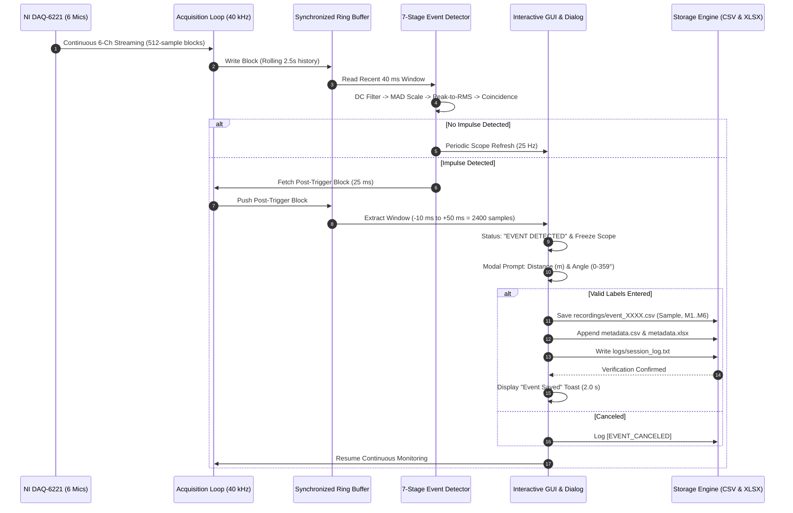

# DATASET COLLECTION WORKFLOW & PROTOCOL

This document defines the Standard Operating Procedure (SOP), hardware calibration protocol, acquisition pipeline, and spatial grid layout for collecting **800 to 960 labeled six-microphone acoustic event recordings** for Direction of Arrival (DOA) and spatial localization research.

---

## 1. System Architecture & Acquisition Pipeline



---

## 2. Experimental Setup & Array Calibration

### Array Orientation & Coordinate Convention
- **Array Center**: $(0, 0, 0)\text{ m}$
- **Radius**: $r = 0.13\text{ m}$ ($13\text{ cm}$, diameter $26\text{ cm}$)
- **Microphone 1 (AI0)**: Positioned at **$0^\circ$ (East / $+X$ Axis)**
- **Microphone 2 (AI1)**: Positioned at **$60^\circ$**
- **Microphone 3 (AI2)**: Positioned at **$120^\circ$ ($+Y$ Axis)**
- **Microphone 4 (AI3)**: Positioned at **$180^\circ$ (West / $-X$ Axis)**
- **Microphone 5 (AI4)**: Positioned at **$240^\circ$**
- **Microphone 6 (AI5)**: Positioned at **$300^\circ$ (South / $-Y$ Axis)**
- **Height**: Maintain circular array on a rigid tripod at $1.20\text{ m}$ above the floor, parallel to the ground.

```
                     Mic 3 (120°)
                     [X: -0.065, Y: +0.113]
                          ▲
                          │
  Mic 4 (180°) ◄──────────┼──────────► Mic 2 (60°)
  [X: -0.130, Y: 0]       │            [X: +0.065, Y: +0.113]
                          │   r = 13 cm
                          │
  Mic 5 (240°)            ▼            Mic 1 (0° / East)
  [X: -0.065, Y: -0.113]               [X: +0.130, Y: 0]
                          ▲
                          │
                     Mic 6 (300°)
                     [X: +0.065, Y: -0.113]
```

---

## 3. Recommended Grid Protocol (800–960 Samples)

To build a high-resolution, robust spatial localization dataset, collect acoustic impulses across a radial polar grid covering diverse distances, azimuth angles, and repetitions.

### Spatial Sampling Grid Matrix

| Distance ($R$) | Angular Resolution ($\Delta \theta$) | Angle Positions ($\theta$) | Repetitions per Point | Total Samples |
| :--- | :--- | :--- | :--- | :--- |
| **$0.75\text{ m}$** (Near Field) | $15^\circ$ ($24\text{ angles}$) | $0^\circ, 15^\circ, 30^\circ, \dots, 345^\circ$ | 2 shots | **48** |
| **$1.50\text{ m}$** (Mid Field 1) | $5^\circ$ ($72\text{ angles}$) | $0^\circ, 5^\circ, 10^\circ, \dots, 355^\circ$ | 3 shots | **216** |
| **$2.50\text{ m}$** (Mid Field 2) | $5^\circ$ ($72\text{ angles}$) | $0^\circ, 5^\circ, 10^\circ, \dots, 355^\circ$ | 3 shots | **216** |
| **$3.50\text{ m}$** (Far Field 1) | $5^\circ$ ($72\text{ angles}$) | $0^\circ, 5^\circ, 10^\circ, \dots, 355^\circ$ | 3 shots | **216** |
| **$5.00\text{ m}$** (Far Field 2) | $10^\circ$ ($36\text{ angles}$) | $0^\circ, 10^\circ, 20^\circ, \dots, 350^\circ$ | 3 shots | **108** |
| **Elevation Offsets ($\pm 15^\circ$)**| $30^\circ$ ($12\text{ angles}$) | Selected positions at $2.0\text{ m}$ | 2 shots | **96** |
| **Grand Total Target** | — | — | — | **900 Samples** |

---

## 4. Step-by-Step Collection Procedure

### Step 1: Physical Setup & Alignments
1. Place the circular microphone array in the center of the test room or outdoor field.
2. Mark the $0^\circ$ reference line on the floor corresponding to **Mic 1**.
3. Use a laser distance meter to measure precise ground-truth distances ($0.75\text{ m}$, $1.5\text{ m}$, $2.5\text{ m}$, $3.5\text{ m}$, $5.0\text{ m}$) along each marked angle radial.
4. Verify NI DAQ USB-6221 is connected to the host PC and all 6 channels (`AI0:AI5`) are wired correctly.

### Step 2: Launch the Collection System
In MATLAB Command Window:
```matlab
cd 'Dataset_Collector';
collect_dataset;
```
1. Verify the GUI displays **`🟢 ARMED & MONITORING (6 CHANNELS)`**.
2. Check that the 6 live oscilloscope traces show low baseline noise ($\pm 10 - 20\text{ mV}$ AC ripple around $1.65\text{V}$ DC bias).

### Step 3: Triggering & Labeling
1. Move acoustic sound source (e.g. starter pistol, clapper slate, acoustic impulse generator, or calibrated speaker playback) to the designated grid location $(R, \theta)$.
2. Generate the acoustic impulse.
3. The system will automatically detect the transient, hold the window, and display:
   ```text
   Event 0001 Detected - Enter Ground Truth Labels
   Enter Distance (meters): 1.50
   Enter Angle (degrees, 0-359): 45.0
   ```
4. Enter the ground truth distance and angle. Press **Enter** or click **OK**.
5. The application saves `recordings/event_0001.csv`, appends `metadata.xlsx` and `metadata.csv`, shows a green confirmation banner for 2 seconds, and resumes monitoring.
6. Repeat for subsequent points on the grid.

---

## 5. Storage Integrity & Crash Recovery Protocol

### Data Persisted per Event
1. **Raw Waveform File** (`data/recordings/event_XXXX.csv`):
   - Exactly $2400\text{ rows} \times 7\text{ columns}$ ($10\text{ ms}$ pre-trigger $+ 50\text{ ms}$ post-trigger at $40\text{ kHz}$).
   - Columns: `Sample,M1,M2,M3,M4,M5,M6`.
2. **Metadata Indices** (`data/metadata.xlsx` and `data/metadata.csv`):
   - Row appended with: `Event`, `Distance_m`, `Angle_deg`, `Timestamp`, `Recording_File`.
3. **Session Audit Trail** (`logs/session_log.txt`):
   - Records timestamp, event ID, sample count, and telemetry.

### Recovery from Interruption or Crash
If the experiment is paused, MATLAB closed, or computer restarted:
1. Simply relaunch `collect_dataset`.
2. `initialize_dataset.m` scans `data/recordings/` and `metadata.*`.
3. It detects the highest event ID (e.g., `event_0350`).
4. Next trigger automatically numbers as `event_0351`.
5. Existing files are never overwritten.
