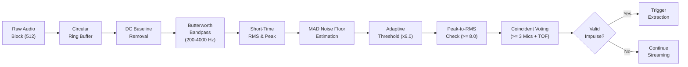

# MATLAB 6-Microphone Acoustic Dataset Collector

A high-performance, standalone MATLAB application dedicated to acquiring, detecting, labeling, and storing synchronized 6-microphone acoustic event recordings for Direction of Arrival (DOA) and acoustic localization research.

> [!NOTE]
> **Independent Application**: This dataset collector is completely decoupled from the real-time localization system. It preserves the exact hardware connectivity, DAQ architecture, and circular array geometry while focusing purely on high-fidelity data acquisition and ground-truth spatial labeling.

---

## 1. Physical Hardware Configuration

The system is configured for the following hardware setup:

| Parameter | Specification | Notes |
| :--- | :--- | :--- |
| **DAQ Device** | National Instruments **NI DAQ-6221** | Device ID: `Dev1` |
| **Analog Inputs** | 6 Single-Ended Channels (`AI0` to `AI5`) | Synchronized multi-channel acquisition |
| **Microphones** | **6 $\times$ MAX4466** Electret Microphones | Low-noise op-amp with adjustable gain |
| **Array Geometry** | **Circular Array (Radius = 13 cm, Diameter = 26 cm)** | Outward-facing microphones |
| **Element Spacing** | Uniform 60° Angular Increments | $0^\circ, 60^\circ, 120^\circ, 180^\circ, 240^\circ, 300^\circ$ |
| **Sampling Rate ($F_s$)**| **$40,000\text{ Hz}$** ($40\text{ kS/s}$ per channel) | Aggregate: $240\text{ kS/s}$ |
| **Speed of Sound ($c$)**| $343.0\text{ m/s}$ ($20^\circ\text{C}$ Dry Air) | Propagation constant |

```
                       Mic 3 (120°)
                           ▲
                           │
      Mic 4 (180°) ◄───────┼───────► Mic 2 (60°)
            ▲              │  r=13cm   ▲
             \             │          /
              \            ▼         /
        Mic 5 (240°)            Mic 1 (0° / East)
                           ▲
                           │
                       Mic 6 (300°)
```

---

## 2. Directory Structure

```text
Dataset_Collector/
│
├── collect_dataset.m               # Master Entry Point & Live GUI Dashboard
├── config.m                        # Hardware, DSP, Buffer & Trigger Configuration
├── CircularBuffer.m                # High-Speed Synchronized 6-Channel Ring Buffer
├── detect_event.m                  # 7-Stage Impulsive Acoustic Event Detector
├── save_event.m                    # Data Persistence Engine (CSV Waveforms & Excel Metadata)
├── initialize_dataset.m            # Directory Setup, Metadata Scanner & Restart Recovery
├── acquisition/
│   ├── initDAQ.m                   # NI-DAQ Session & Simulation Fallback Streamer
│   ├── readBlock.m                 # Synchronized Multi-Channel Block Acquisition
│   └── stopDAQ.m                   # Hardware Teardown & Buffer Flush
├── data/
│   ├── recordings/                 # Saved 6-channel synchronized waveforms (event_XXXX.csv)
│   ├── metadata.xlsx               # Excel Master Index (Event, Distance_m, Angle_deg, Timestamp, File)
│   └── metadata.csv                # CSV Master Index (Cross-platform compatibility)
├── logs/
│   └── session_log.txt             # Timestamped Session and Audit Log
├── tests/
│   ├── runAllCollectorTests.m      # Comprehensive Automated Test Runner
│   ├── testDetector.m              # Impulse Detection & Noise Rejection Unit Tests
│   ├── testStorage.m               # Persistence, Verification & Recovery Unit Tests
│   └── testCircularBuffer.m        # Multi-Channel Ring Buffer Unit Tests
├── README.md                       # Complete Technical Documentation (This File)
└── DATASET_COLLECTION_WORKFLOW.md  # Standard Operating Procedure for 800-960 Sample Collection
```

---

## 3. Impulsive Acoustic Detection Engine

The event detector (`detect_event.m`) continuously monitors the rolling circular buffer using a multi-stage digital signal processing pipeline tailored for sharp acoustic transients (gunshot playbacks, claps, spark discharges, slates):



### Detection Pipeline Stages:
1. **DC Baseline Offset Removal**: Subtracts the rolling channel median to center MAX4466 $1.65\text{V}$ bias at $0\text{V}$.
2. **Butterworth Bandpass Shaping**: $4^{\text{th}}$-order zero-phase filter passing $200 - 4,000\text{ Hz}$ to suppress ambient HVAC rumble and ultrasonic noise.
3. **Short-Time RMS**: Computes signal energy across a $25\text{ ms}$ analysis sliding window.
4. **MAD Noise Floor Scale Estimation**: Computes the Median Absolute Deviation:
   $$\sigma_{\text{MAD}} = 1.4826 \cdot \text{median}(|x - \text{median}(x)|)$$
5. **Adaptive Thresholding**: Dynamic trigger threshold:
   $$T = \text{median} + \text{ThresholdMultiplier} \cdot \sigma_{\text{MAD}}$$
6. **Peak-to-RMS Impulsive Ratio**: Validates impulsive crest factor:
   $$\text{Ratio}_{\text{impulse}} = \frac{\max(|x[n]|)}{\text{RMS}(x)} \ge 8.0$$
7. **Coincident Channel Voting & Travel Time Constraint**: Requires $\ge 3$ coincident microphone triggers whose peak arrival times lie within the theoretical physical travel window across the $26\text{ cm}$ circular array ($|\Delta t_{\max}| = 2r/c \approx 0.76\text{ ms} \approx 30.3\text{ samples}$ at $40\text{ kHz}$).
8. **Refractory Cooldown**: $100\text{ ms}$ blind period preventing acoustic room reverberation re-triggers.

### Threshold Reference Table

| Parameter | Default Value | Sample Count | Function & Description |
| :--- | :--- | :--- | :--- |
| `Sampling Rate` | $40,000\text{ Hz}$ | — | Master ADC sampling frequency per channel |
| `Bandpass` | $200 - 4,000\text{ Hz}$ | — | Active acoustic impulse passband |
| `ThresholdMultiplier` | $6.0$ | — | Sensitivity factor above MAD background noise |
| `PeakRatioThreshold` | $8.0$ | — | Rejects continuous noise; passes sharp transients |
| `MinimumTriggerChannels`| $3$ | — | Requires $\ge 3$ mics to register coincident arrival |
| `MinimumEventDuration` | $0.5\text{ ms}$ | $20\text{ samples}$ | Rejects sub-millisecond electrical noise spikes |
| `PreTrigger` | $10\text{ ms}$ | $400\text{ samples}$ | Retrospective capture before impulse peak |
| `PostTrigger` | $50\text{ ms}$ | $2000\text{ samples}$ | Captures blast wave, tail, and early reflections |
| `Total Event Window` | $60\text{ ms}$ | $2400\text{ samples}$ | Total saved synchronized waveform length |
| `Cooldown` | $100\text{ ms}$ | $4000\text{ samples}$ | Blind period preventing echo re-triggers |

---

## 4. User Labeling & Workflow

When an acoustic event is detected:

1. Live trigger processing pauses to hold the captured event window.
2. The GUI displays a prominent **`🔴 EVENT DETECTED`** banner.
3. A modal input dialog prompts the experimenter:
   - **`Enter Distance (meters):`** Accepts decimal values $> 0$ (e.g. `1.50`, `2.00`).
   - **`Enter Angle (degrees):`** Accepts values in $[0, 359.99]$ (e.g. `45.0`, `180.0`).
4. **Input Validation**:
   - Non-numeric or out-of-range inputs trigger a warning dialog, allowing re-entry without discarding the captured acoustic window.
   - Clicking **`Cancel`** skips saving this event and safely resumes monitoring without incrementing the event ID.
5. Upon valid entry:
   - Waveform CSV is saved to `data/recordings/event_XXXX.csv`.
   - Master metadata is appended to `data/metadata.xlsx` and `data/metadata.csv`.
   - A success banner **`✅ Event XXXX Saved Successfully`** appears on the GUI for 2.0 seconds.
   - Continuous DAQ acquisition resumes seamlessly.

---

## 5. Storage Schema & Persistence

### Waveform Recording CSV (`data/recordings/event_XXXX.csv`)
Full 6-channel raw synchronized voltage window ($2400\text{ samples} = 60\text{ ms}$ at $40\text{ kS/s}$):

```csv
Sample,M1,M2,M3,M4,M5,M6
1,1.652310,1.648920,1.650110,1.649500,1.651230,1.648010
2,1.651890,1.649100,1.650420,1.649810,1.650980,1.648220
...
2400,1.650120,1.649800,1.650050,1.650110,1.650200,1.649950
```

### Master Metadata Spreadsheet (`data/metadata.xlsx` & `data/metadata.csv`)
Maintains an append-only index of all collected recordings:

| Event | Distance_m | Angle_deg | Timestamp | Recording_File |
| :--- | :--- | :--- | :--- | :--- |
| `event_0001` | `1.500` | `0.00` | `2026-09-01 14:30:15.123` | `recordings/event_0001.csv` |
| `event_0002` | `1.500` | `15.00` | `2026-09-01 14:31:02.456` | `recordings/event_0002.csv` |
| `...` | `...` | `...` | `...` | `...` |
| `event_0827` | `3.000` | `345.00` | `2026-09-01 17:45:10.789` | `recordings/event_0827.csv` |

---

## 6. Restart & Crash Recovery

The application is fully resilient to MATLAB restarts, computer reboots, or unexpected power interruptions:

1. Upon startup, `initialize_dataset.m` scans `data/recordings/` and parses `metadata.*`.
2. It detects the highest event number present (e.g. `event_0827`).
3. It sets `nextEventId = 828`.
4. Previous recordings are never overwritten; numbering resumes seamlessly.

---

## 7. How to Launch and Run

### Launch in MATLAB:
```matlab
cd 'Dataset_Collector';
collect_dataset;
```

### Run Automated Unit Tests:
```matlab
cd 'Dataset_Collector/tests';
runAllCollectorTests;
```

---

## 8. Troubleshooting

| Issue | Cause | Solution |
| :--- | :--- | :--- |
| **`NI-DAQ Hardware Unavailable`** | DAQ USB disconnected or Dev1 not assigned | Verify USB cable. Check NI MAX to confirm device is named `Dev1`. Application will automatically run in Simulation Streamer mode for testing. |
| **`Excel File Lock Warning`** | `metadata.xlsx` is open in Microsoft Excel | Close Excel. The program automatically saves to `metadata.csv` and preserves the raw recording CSV so no data is ever lost. |
| **`False Triggers from Ambient Noise`** | High lab background noise | Increase `cfg.trigger.multiplier` in `config.m` from `6.0` to `7.5`. |
| **`Missed Weak Impulses`** | Low sound level from distant source | Decrease `cfg.trigger.multiplier` in `config.m` to `4.5` or adjust physical MAX4466 potentiometer gain. |
